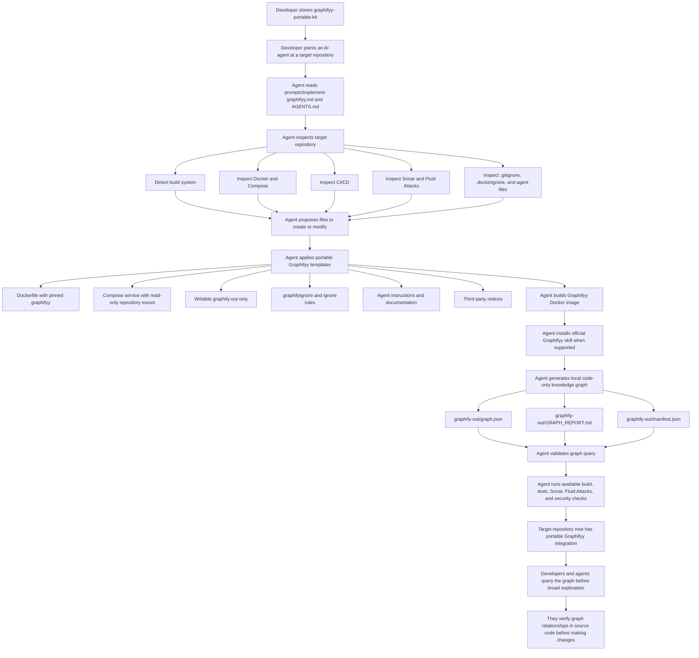
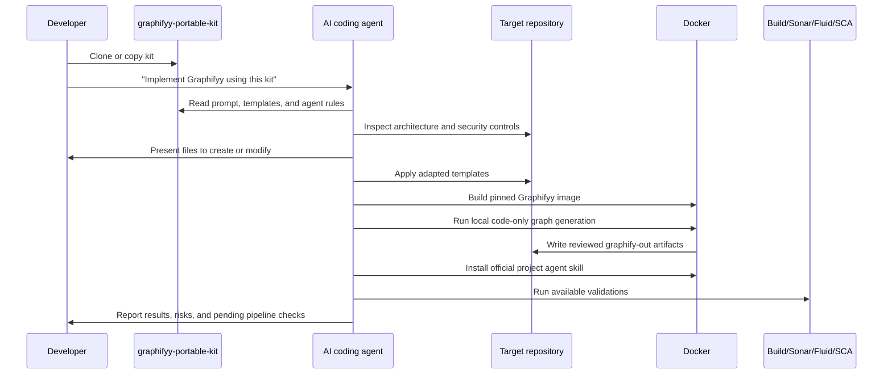

# Graphifyy Portable Kit

Portable, secure, agent-friendly integration kit for adding Graphifyy to existing repositories.

Status: `v0.1.0`, public-ready agent-driven kit. The template set is usable now; the automatic installer CLI is designed but not implemented yet.

The goal of this project is to let any team clone this kit, point an AI coding agent at a target repository, and ask:

```text
Implement Graphifyy in this project using graphifyy-portable-kit.
```

The agent should then inspect the target project, apply the smallest safe integration, and leave the repository with a Docker-based Graphifyy workflow that does not require local Python.

## How It Works



## Installation Model



## Goals

- Run Graphifyy through Docker, not local Python.
- Persist reviewed knowledge artifacts in `graphify-out/`.
- Install the official Graphifyy agent skill when supported.
- Keep normal analysis local-only by default.
- Avoid privileged containers, exposed ports, Docker socket mounts, broad write mounts, and open dependency ranges.
- Preserve Sonar, Fluid Attacks, SAST, SCA, secret scanning, and existing CI quality gates.
- Support common repository ecosystems such as Java, Node.js, Python, .NET, Go, Rust, PHP, mobile, and IaC without treating generated dependency folders as project source.
- Add only the files needed for the detected project.
- Be idempotent: repeated installation should not overwrite unrelated user changes.
- Be auditable: every generated file should have a clear purpose.

## Non Goals

- This kit does not change application logic.
- This kit does not bypass security findings.
- This kit does not enable external LLM analysis by default.
- This kit does not store credentials, API keys, or tokens.
- This kit does not create commits or push branches.

## Target Repository Outcome

A successfully integrated target repository should have:

- A pinned Graphifyy version.
- A pinned Python slim base image, preferably with digest.
- A Graphifyy Dockerfile.
- A Compose service for normal read-only analysis.
- A separate setup command for project agent skill installation.
- `.graphifyignore`.
- Git ignore rules that version only reviewed graph outputs.
- `graphify-out/graph.json`.
- `graphify-out/GRAPH_REPORT.md`.
- `graphify-out/manifest.json`.
- Agent instructions explaining safe Graphifyy usage.
- Documentation explaining operation, privacy, security, update, and rollback.
- Third-party notices for Graphifyy and transitive dependencies.

## Suggested Repository Layout

This kit is intentionally template-first:

```text
graphifyy-portable-kit/
  AGENTS.md
  README.md
  prompts/
  templates/
  installer/
```

The first version is designed for agents to apply. A later version can add a CLI installer that renders these templates automatically.

## Quick Use

1. Clone this kit beside or inside the target repository.
2. Ask the coding agent to read `prompts/implement-graphifyy.md`.
3. Provide the target repository path.
4. Let the agent inspect, patch, run Docker-based Graphifyy, and report validations.

Example request:

```text
Use graphifyy-portable-kit to implement Graphifyy in C:/path/to/my/project.
Do not commit or push. Preserve all security controls.
```

## Current Template Version

- Kit version: `0.1.0`
- Graphifyy package: `graphifyy==0.9.22`
- Python base image: `python:3.12.13-slim-trixie`
- Python base digest: `sha256:57cd7c3a7a273101a6485ba99423ee568157882804b1124b4dd04266317710de`
- Default mode: local code-only extraction
- External model analysis: disabled by default

## Verify The Kit

Before publishing or after changing templates, run:

```powershell
./scripts/verify-kit.ps1
```

The verifier checks required files, pinned versions, Docker and Compose hardening assumptions, ignore rules, and obvious secret-like patterns.

## Release Readiness

Use `PUBLICATION_CHECKLIST.md` before tagging a release. Use `docs/testing-target-repos.md` to validate the kit against disposable repositories before promoting it for broader use.

## Ignore Strategy

The ignore templates are intentionally broad for generated outputs, dependency caches, IDE metadata, test reports, binary artifacts, and local secrets across multiple ecosystems. They should not be used to hide first-party source code from Graphifyy, Sonar, Fluid Attacks, or other controls.

When applying the kit to a target repository, the agent must review the generated `.graphifyignore`, `.gitignore`, and `.dockerignore` changes against the repository layout. If a project intentionally vendors source code, generated code, lockfiles, or build artifacts that must be analyzed, the agent should narrow the ignore rule and document why.
